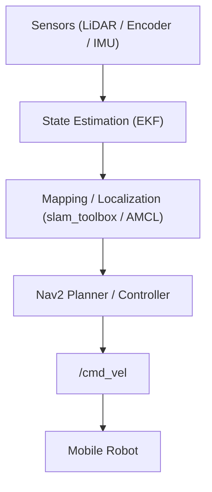

# 🛡️ Autonomous Security & Patrol Robot (ROS 2 Nav2)

## 🚀 Key Features

**[🇰🇷 KR]**
- ROS2 Nav2 기반 자율주행 파이프라인 구축 (Mapping → Localization → Navigation)
- Waypoint 기반 순찰 로봇 시스템 구현 (Event-triggered navigation)
- EKF 기반 LiDAR + Odometry + IMU 센서 융합
- Local Planner (DWB → MPPI) 성능 비교 실험 설계
- 실제 환경(복도/사람 장애물) 기반 반복 실험 수행 예정

**[🇺🇸 EN]**
- Established ROS2 Nav2-based autonomous navigation pipeline
- Implemented waypoint-based patrol robot system
- EKF-based sensor fusion (LiDAR + Odometry + IMU)
- Performance comparison experiment design for Local Planners (DWB vs MPPI)
- Scheduled repeated experiments in real-world environments (corridors/human obstacles)

## 💡 Expected Contribution

**[🇰🇷 KR]**
- 실제 운용 환경에서 DWB와 MPPI의 정량적 성능 비교
- 동적 장애물(사람 간섭) 발생 시 플래너(Planner)의 주행 양상 분석
- 보안 로봇 시스템 실제 배치를 위한 실용적인 튜닝 인사이트 제공

**[🇺🇸 EN]**
- Quantitative comparison between DWB and MPPI in real-world environments
- Analysis of planner behavior under dynamic obstacles (human interaction)
- Practical tuning insights for deployment in security robot systems

👉 Choose your language: **[🇰🇷 Korean (한국어)](#-korean-version)** | **[🇺🇸 English](#-english-version)**

---

## 🇰🇷 Korean Version

### 1. 프로젝트 개요
본 프로젝트는 보안 및 순찰 로봇을 목표로 하는 ROS2 기반 자율주행 모바일 로봇 시스템 개발을 목적으로 합니다.
시스템은 2D LiDAR, Wheel Odometry, IMU를 기반으로 Localization 및 Navigation 구조를 구성하며, Nav2 환경에서 이벤트 기반 Waypoint 주행을 수행하도록 설계되었습니다.
또한 향후 Local Planner인 DWB와 MPPI의 비교 실험을 통해 보안 로봇 환경에 적합한 주행 전략을 분석할 예정입니다.
최종적으로는 GUI 시스템과 연동하여 상위 보안 시스템과 통합 가능한 구조로 확장하는 것을 목표로 하지만, 본 저장소의 핵심 초점은 로봇 주행 및 Planner 실험 환경 구축에 있습니다.

### 2. 프로젝트 목표

#### 🎯 단기 목표
- 안정적인 2D 맵 생성
- Localization 기반 Waypoint 주행 구현
- Nav2 Local Planner 적용 및 기본 성능 검증

#### 🚀 중기 목표
- DWB 반복 실험 수행
- Planner별 성능 비교 및 실험 로그 기반 정량 평가 수행

#### 🏆 최종 목표
- 보안 로봇 환경에 적합한 Local Planner를 선정하고, 실제 배치를 고려한 튜닝 가이드 제시

### 3. 시스템 아키텍처

**하드웨어 구성**
- Mobile base, 2D LiDAR, Wheel encoder, IMU, On-board PC (Jetson Orin NX)

**소프트웨어 구성**
- ROS2, slam_toolbox, robot_localization (EKF), Nav2, RViz2

**데이터 토픽 흐름 (Main Data Flow)**
- Sensor Inputs: `/scan`, `/odom`, `/imu`
- State Estimation: `/tf` (EKF output)
- Mapping/Localization: `/map`, `/amcl_pose`
- Control Output: `/cmd_vel`

**흐름 설명**
로봇은 LiDAR, Wheel Encoder, IMU 데이터를 수집합니다. 이 데이터는 EKF(확장 칼만 필터) 기반 상태 추정을 통해 융합되고, 그 결과로 추정된 자세(Pose)는 Mapping 또는 Localization에 사용됩니다. 추정된 자세와 목표 Waypoint를 기반으로 Nav2는 Global Path를 생성하고, Local Controller가 실제 주행 명령을 계산합니다. 최종 제어 명령은 `/cmd_vel`을 통해 로봇 구동부로 전달됩니다.



### 4. 기술 스택
- **OS**: Ubuntu 22.04
- **Middleware**: ROS2 Humble
- **Language**: Python, C++
- **Navigation**: Nav2
- **Mapping**: slam_toolbox
- **Localization**: AMCL, robot_localization
- **Visualization**: RViz2

### 5. 현재 진행 상황

진행된 컴포넌트는 다음과 같습니다:
- ✅ 기본 모바일 로봇 주행 환경
- ✅ LiDAR 스캔 수신 및 TF 연동
- ✅ Wheel Odometry 연동
- ✅ IMU 연동 및 움직임 안정화
- ✅ EKF 기반 센서 융합 구성
- ✅ `slam_toolbox`를 활용한 2D 맵 생성
- ✅ 저장된 맵 기반 Localization 구성
- ✅ Nav2 Bringup 및 기본 Waypoint 주행 검증
- 🔄 DWB 기반 실험을 위한 기본 내비게이션 프레임워크 준비
- ⏳ DWB 반복 실험
- ⏳ 정량적 플래너 비교
- ⏳ GUI / 상위 시스템 연동

현재까지 기본적인 센서 연동, 상태 추정, 맵 생성, Localization, Waypoint 주행까지의 End-to-End 파이프라인이 구축되었습니다. 특히 Nav2 Bringup 이후 저장된 맵을 기반으로 Waypoint 주행이 가능한 상태까지 확인하였으며, 현재는 DWB 반복 실험 직전 단계에 있습니다. 이후에는 반복 주행 실험과 Planner 비교를 통해 성능을 정량적으로 분석할 예정입니다.

### 6. 네비게이션 파이프라인

주행 계획 단계에서는 **GUI에서 전달되는 Waypoint** 또는 **소리 센서를 통한 이벤트 감지**가 주행 트리거로 사용됩니다.

| 단계 (Stage) | 설명 (Description) |
| :--- | :--- |
| **1. Perception** | LiDAR 스캔, Wheel Odometry, IMU 데이터 수집 |
| **2. State Estimation** | EKF를 활용한 로봇 자세 확인 및 안정화 |
| **3. Mapping/Localization** | `slam_toolbox` 또는 Map+AMCL을 이용한 위치 추정 |
| **4. Planning**| Waypoint/이벤트 기반 Nav2 전역 경로(Global Path) 생성 |
| **5. Control** | Controller를 이용한 지역 경로(Local Trajectory) 생성 |
| **6. Execution** | `/cmd_vel`을 통한 최종 이동 명령 전송 |

### 7. 현재까지의 결과 및 미디어

*(Note: 아래 플레이스홀더에 실제 이미지/영상 주소를 교체해주세요)*

**📸 주요 이미지**
1. **Robot Hardware:** 풀 세팅 로봇 사진 (LiDAR, IMU, PC)
2. **Sensor Mounting:** 센서 장착부 근접 샷
3. **Generated Map:** 생성된 2D 점유 격자 지도 (Occupancy Map)
4. **Mapping Process:** 생성 중인 슬램 스캔 및 TF 트리 (RViz2)
5. **Localization/Navigation:** 맵, 로봇 위치, 경로, 코스트맵 현황 (RViz2)
6. **Waypoint Navigation:** 목적지 이동 모식도
7. **System Structure:** 전체 `rqt_graph` 토픽 맵
8. **Experimental Setup:** 복도, 좁은 틈새 등 실제 주행 테스트 환경 사진

**🎥 시연 비디오**
- 맵핑(Mapping) 진행 영상
- Localization 기반 워이포인트 주행 영상
- 본 실험 돌입 전 기본 회피 주행 테스트 영상
- 동일 경로 반복 주행 영상

### 8. 실험 계획

현재 단계에서는 DWB 반복 실험을 먼저 수행하고, 이후 MPPI와 비교하는 구조가 자연스럽습니다. 주행 중 인간 장애물이 앞을 막을 때의 회피 기동은 중요하지만, 깔끔한 비교 분석을 위해 완전히 랜덤한 움직임보다는 부분적으로 통제된 시나리오부터 시작합니다.

**📝 고정 실험 시나리오**
| 시나리오 | 설명 | 목적 |
| :--- | :--- | :--- |
| **A: 직진 복도 주행** | 장애물이 없는 복도에서 동일 Waypoint 간 반복 주행 | 기본 주행 반복성 평가 |
| **B: 고정 장애물** | 정상 경로 상에 고정형 장애물 배치 | 회피 및 경로 재계획 검증 |
| **C: 동적 인간 간섭** | 정해진 타이밍, 특정 위치에서 사람이 앞을 막음 | 동적 장애물 회피 평가 |
| **D: 협소 공간** | 좁은 복도나 문턱을 반복 통과 | 협소 공간 주행 안정성 평가 |

**📊 1차 실험 구조 (Phase 1~3)**
- **Phase 1 (기본 반복):** 2~3개 Waypoint 고정 주행, 최소 10회 검증 (성공률, 도달시간 측정)
- **Phase 2 (통제된 인간 간섭):** 사람이 동일 위치/타이밍에 앞을 가로막은 채 정지/회피 양상 비교
- **Phase 3 (플래너 튜닝):** DWB 파라미터(진동 감쇠, 회피 품질) 조정 후, MPPI 적용 비교

### 9. 실험 항목 및 성능 지표

| 실험 항목 | 목적 | 성과 지표 |
| :--- | :--- | :--- |
| **반복 주행 평가** | 안정성 검증 | 성공률, 소요 시간, 궤적 편차 |
| **파라미터 튜닝** | 통제 변인에 대한 민감도 검사 | 주행 진동 현상, 궤적 부드러움 |
| **동적/협소 환경 테스트** | 실제 배치 가능성 검증 | 충돌 횟수, 리커버리(Recovery) 발생 빈도 |
| **장기 운용 테스트** | 일관성(재현성) 확보 | 실험 간 편차 확인 |

**🛠️ 정량적 지표 (Quantitative Metrics)**
- `Time-to-goal [s]`: 목표 도달 소요 시간
- `Path length [m]`: 실제 주행 이동 거리
- `Path deviation [m]`: 최적 경로 대비 횡방향 이탈 오차
- `Collision / near-collision count`: 충돌 및 근접 위험 횟수
- `Recovery behavior count`: 리커버리(스핀 등) 동작 발생 횟수
- `Oscillation count`: 눈에 띄는 진동 또는 좌우 흔들림 발생 빈도
- `Average linear velocity [m/s]`: 실제 경로상의 평균 선속도
- `CPU usage [%]`: 주행 중 평균 연산 부하율

> **💡 실험의 기저 방향:**  
> 사람이나 장애물이 막는 상황은 이론적으로 부드럽게 피할 것을 기대하지만, **실제로는 진동, 급정지, 우회 실패, 리커버리 지연** 현상이 잦습니다. 이 **'기대(Theory)'와 '현상(Behavior)' 간의 차이를 기록**하여 최적의 튜닝 포인트를 찾아내는 것이 우리의 목표입니다.

### 10. 실행 튜토리얼 (How to Run)

본 시스템은 로봇의 기본 구동, SLAM(지도 작성), Nav2(자율 주행) 시나리오를 지원합니다.

**[0. 공통 사항 (빌드 및 소싱)]**
새로운 터미널을 열 때마다 반드시 워크스페이스를 다시 소싱해야 합니다.
```bash
cd ~/navigation_stack_lab/ws_robot
colcon build --symlink-install
source install/setup.bash
```

**[1. SLAM 프로토콜 (지도 작성)]**
새로운 맵을 그릴 때 활용합니다.
- 터미널 1 (기본 구동): `ros2 launch robot_base bringup.launch.py`
- 터미널 2 (SLAM 켜기): `ros2 launch robot_base slam.launch.py`
- 터미널 3 (지도 저장): `ros2 run nav2_map_server map_saver_cli -f ~/navigation_stack_lab/ws_robot/src/robot_base/maps/my_map --ros-args -p save_map_timeout:=10000`

**[2. Nav2 프로토콜 (자율 주행)]**
완성된 맵을 바탕으로 내비게이션 알고리즘을 켤 때 활용합니다.
- 터미널 1 (기본 구동): `ros2 launch robot_base bringup.launch.py`
- 터미널 2 (Nav2 구동): `ros2 launch robot_base nav2.launch.py` *(백그라운드에서 TF Bridge 연동됨)*
- 터미널 3 (패트롤 등 부가기능): `ros2 launch robot_base patrol.launch.py`

> 💡 **초기 위치 설정 (필수 단계):** RViz2 구동 직후 `2D Pose Estimate`를 눌러 로봇 초기 위치와 각도를 한 번 지정해 주어야 AMCL이 파티클을 초기화하며 방향을 잡습니다. 이후 `Nav2 Goal`을 찍어주면 주행을 시작합니다.

### 11. 트러블슈팅 및 이슈 문서 (Troubleshooting Docs)
프로젝트 개발 과정에서 겪은 주요 하드웨어 및 소프트웨어 이슈와 해결책은 아래 문서들을 참고해 주세요.
- 📡 [Sensor Integration Issues (LiDAR 센서 이슈)](docs/sensor_issues.md)
- 🛞 [Control & Encoder Issues (제어 및 인코더 이슈)](docs/control_and_encoder.md)
- 🗺️ [TF and Frame Issues (좌표계 변환 이슈)](docs/tf_and_frame.md)
- 🧩 [Mapping Issues (SLAM 맵 왜곡 이슈)](docs/mapping_issues.md)
- 🚥 [Navigation Issues (경로 진동 및 잔상 한계 이슈)](docs/navigation_issues.md)


---
<br/>
<br/>

## 🇺🇸 English Version

### 1. Project Overview
This project focuses on developing a ROS2-based autonomous mobile robot system for security and patrol applications. 
The system is built on a localization and navigation pipeline using 2D LiDAR, wheel odometry, and IMU.
It is designed to perform event-triggered waypoint navigation in a Nav2 environment.
As a future extension, this project plans to compare DWB and MPPI local planners to analyze which controller is more suitable for security robot deployment.
The robot will eventually be integrated into a higher-level GUI-based security system, although the main focus of this repository is the robot-side navigation and planner evaluation pipeline.

### 2. Project Objectives

#### 🎯 Short-term Objectives
- Build a stable 2D mapping pipeline
- Achieve localization-based waypoint navigation
- Apply and validate Nav2 local planners in a basic setup

#### 🚀 Mid-term Objectives
- Conduct repeated DWB experiments
- Compare planner performance and perform quantitative evaluation using experiment logs

#### 🏆 Final Objective
- Select a suitable local planner for security robot environments and provide practical tuning guidelines for deployment

### 3. System Architecture

**Hardware**
- Mobile base, 2D LiDAR, Wheel encoder, IMU, On-board PC (Jetson Orin NX)

**Software**
- ROS2, slam_toolbox, robot_localization (EKF), Nav2, RViz2

**Main Data Flow**
- Sensor Inputs: `/scan`, `/odom`, `/imu`
- State Estimation: `/tf` (EKF output)
- Mapping/Localization: `/map`, `/amcl_pose`
- Control Output: `/cmd_vel`

**Architecture Description**
The robot collects sensor measurements from LiDAR, wheel encoders, and IMU. These data are fused using EKF-based state estimation, and the estimated pose is then used for mapping or localization. Based on the current pose and the target waypoint, Nav2 generates a global path and the local controller computes motion commands. The final control command is published through `/cmd_vel` to drive the mobile base.


### 4. Tech Stack
- **OS**: Ubuntu 22.04
- **Middleware**: ROS2 Humble
- **Language**: Python, C++
- **Navigation**: Nav2
- **Mapping**: slam_toolbox
- **Localization**: AMCL, robot_localization
- **Visualization**: RViz2

### 5. Current Progress

The following components have been implemented or prepared so far:
- ✅ Basic mobile robot driving environment
- ✅ LiDAR scan reception and TF connection
- ✅ Wheel odometry integration
- ✅ IMU integration and motion stabilization
- ✅ EKF-based sensor fusion configuration
- ✅ 2D map generation using `slam_toolbox`
- ✅ Localization setup based on a saved map
- ✅ Nav2 bringup and verification of basic waypoint navigation
- 🔄 Basic navigation framework prepared for DWB-based experiments
- ⏳ Repeated DWB experiments
- ⏳ Quantitative planner comparison
- ⏳ GUI / higher-level system integration

At the current stage, the end-to-end pipeline from sensor integration to localization and waypoint navigation has been established. Waypoint-based navigation on a saved map has already been verified, and the project is now at the stage immediately before repeated DWB experiments. The next step is to conduct repeated runs and compare planners using quantitative metrics.

### 6. Navigation Pipeline

At the planning stage, robot motion is triggered by either **waypoints sent from the GUI system** or **event detection from a sound sensor**.

| Stage | Description |
| :--- | :--- |
| **1. Perception** | Collect LiDAR scan, wheel odometry, and IMU data |
| **2. State Estimation** | Stabilize robot pose using EKF |
| **3. Mapping / Localization** | Estimate pose using `slam_toolbox` or saved map + AMCL |
| **4. Planning**| Generate a global path in Nav2 based on waypoint/event |
| **5. Control** | Generate a local trajectory using the DWB controller |
| **6. Execution** | Publish motion commands through `/cmd_vel` |

### 7. Results So Far & Media

*(Note: Replace placeholders with actual image/video links when available)*

**📸 Recommended Images**
1. **Robot Hardware:** Full robot platform with LiDAR, IMU, onboard PC.
2. **Sensor Mounting:** Close-up of LiDAR / IMU mounting position.
3. **Generated Map:** Saved occupancy map result.  
4. **Mapping Process:** RViz2 screenshot during mapping (Scan + TF).
5. **Localization/Navigation:** RViz2 screenshot showing map, robot pose, path, and costmap.
6. **Waypoint Navigation:** Goal point and robot path visible on the UI.
7. **System Structure:** TF tree or `rqt_graph` topic screenshot.
8. **Experimental Setup:** Photo of corridor, indoor path, or narrow passage.

**🎥 Recommended Videos**
- Mapping process in an indoor environment
- Localization-based waypoint navigation
- Basic autonomous run toward a waypoint before formal experiments
- Repeated run demo on the same route

### 8. Experimental Plan

At this stage, it is natural to begin with repeated DWB experiments and later extend the same protocol to MPPI. The idea of testing how the robot reacts when a person blocks the robot from the front during navigation is a strong and realistic scenario for a security/patrol robot. However, for a clean comparison, the experiment should start from a controlled and repeatable setup rather than a fully random human motion pattern.

**📝 Recommended Fixed Experimental Scenarios**
| Scenario | Description | Purpose |
| :--- | :--- | :--- |
| **A: Straight corridor waypoint run** | Robot repeatedly moves between fixed waypoints | Baseline repeatability |
| **B: Static obstacle on route** | A fixed obstacle is placed on the reference path | Evaluate avoidance/replanning |
| **C: Human blocking at fixed timing** | A person steps into the path at a predefined position | Evaluate dynamic obstacle handling |
| **D: Narrow passage navigation** | Robot repeatedly passes through a narrow corridor | Evaluate stability in constrained spaces |

**📊 Recommended Initial Experiment Structure**
- **Phase 1. Baseline repeated navigation:** Fix 2~3 waypoints and repeat at least 10 times without obstacles. Measure success rate, travel time, and path deviation.
- **Phase 2. Controlled human blocking:** Keep the same route. A person blocks the robot identically. Record stops, avoidance, or recovery frequencies identically.
- **Phase 3. Planner tuning:** Tune DWB parameters (oscillation, avoidance quality). Apply the same later to MPPI.

### 9. Experiment Items and Metrics

| Experiment | Purpose | Metrics |
| :--- | :--- | :--- |
| **Repeated DWB navigation** | Evaluate waypoint navigation stability | Success rate, travel time, path deviation |
| **Planner tuning experiment** | Check parameter sensitivity | Oscillation, path smoothness |
| **Dynamic / narrow env test** | Verify deployment feasibility | Collision count, recovery frequency |
| **Long-run repeated test** | Evaluate reproducibility | Run-to-run variance |

**🛠️ Additional Recommended Quantitative Metrics**
- `Time-to-goal [s]`: Time required to reach the target
- `Path length [m]`: Actual traveled distance
- `Path deviation [m]`: Difference from the reference route
- `Collision / near-collision count`: Safety performance
- `Recovery behavior count`: Number of recovery actions
- `Oscillation count`: Number of visible heading/speed oscillations
- `Average linear velocity [m/s]`: Practical motion efficiency
- `CPU usage [%]`: Computational load during execution

> **💡 Experimental Rationale:**  
> The human-blocking scenario is relevant because it reflects a practical deployment condition. From a theoretical perspective, the planner is expected to avoid the human smoothly. In real deployment, however, the robot may show **oscillation, abrupt stopping, repeated recovery behavior, or unstable detours**. Capturing this gap between expected theory and observed behavior is one of the key contributions to finding the optimal tuning factors.

### 10. Execution Protocol (How to Run)

This system supports the basic operation of the robot, SLAM (mapping), and Nav2 (autonomous navigation) scenarios.

**[0. Common Setup (Build and Source)]**
Every time you open a new terminal, you must build and source the workspace package.
```bash
cd ~/navigation_stack_lab/ws_robot
colcon build --symlink-install
source install/setup.bash
```

**[1. SLAM Protocol (Mapping)]**
Use this when creating a map in a new environment.
- **Terminal 1 (Hardware Bringup)**: `ros2 launch robot_base bringup.launch.py`
- **Terminal 2 (Activate SLAM)**: `ros2 launch robot_base slam.launch.py`
- **Terminal 3 (Save Map)**: `ros2 run nav2_map_server map_saver_cli -f ~/navigation_stack_lab/ws_robot/src/robot_base/maps/my_map --ros-args -p save_map_timeout:=10000`

**[2. Nav2 Protocol (Autonomous Navigation)]**
Use this to turn on the autonomous navigation algorithm based on a saved map.
- **Terminal 1 (Hardware Bringup)**: `ros2 launch robot_base bringup.launch.py`
- **Terminal 2 (Run Nav2 Navigation)**: `ros2 launch robot_base nav2.launch.py` *(the TF Bridge is automatically launched in the background)*
- **Terminal 3 (Patrol Behavior Extras)**: `ros2 launch robot_base patrol.launch.py`

> 💡 **Initial Pose Setup (Required Before Use):**  
> 1) Right after launching RViz2, the robot does not know its initial position.  
> 2) Click `2D Pose Estimate` to set the robot's initial position and orientation on the map (so AMCL can initialize properly).  
> 3) Once the laser scan aligns tightly with the walls, use `Nav2 Goal` to set a destination and verify navigation.

### 11. Troubleshooting & Issue Docs
For major hardware and software issues encountered during development and their solutions, please refer to the detailed documents below.
- 📡 [Sensor Integration Issues](docs/sensor_issues.md)
- 🛞 [Control & Encoder Issues](docs/control_and_encoder.md)
- 🗺️ [TF and Frame Issues](docs/tf_and_frame.md)
- 🧩 [Mapping Issues](docs/mapping_issues.md)
- 🚥 [Navigation Issues](docs/navigation_issues.md)
