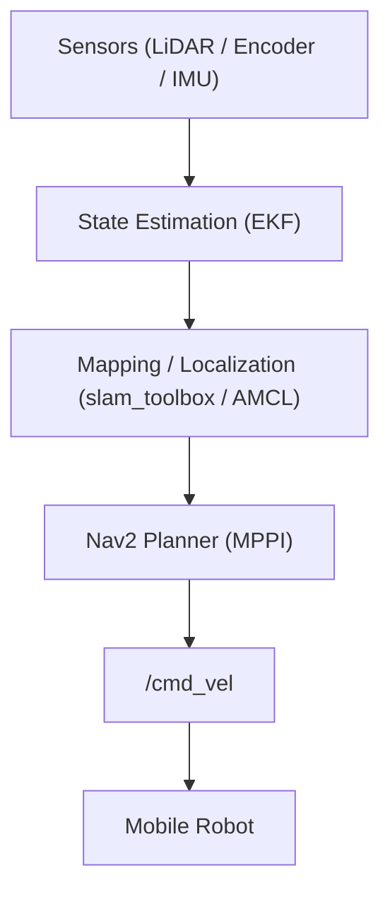

# Autonomous Security & Patrol Robot — ROS 2 + Nav2

**[KR]** ROS 2 Nav2 기반 자율주행 순찰 로봇 시스템입니다. 실제 환경(복도, 사람 장애물)에서 SLAM → 위치 추정 → Waypoint 순찰까지의 End-to-End 파이프라인을 직접 구축하고 운용했습니다.

**[EN]** An autonomous patrol robot system built on ROS 2 Nav2, covering the full pipeline from SLAM and EKF-based localization to waypoint patrol navigation in an indoor environment.

---

## 주요 기능

- ROS 2 Nav2 기반 자율주행 파이프라인 (Mapping → Localization → Navigation)
- EKF 기반 센서 융합 (2D LiDAR + Wheel Odometry + IMU)
- GUI 연동 JSON 기반 Waypoint 순찰 (왕복 핑퐁 패턴)
- 각 순찰 지점 도착 시 카메라 촬영 트리거
- Local Planner DWB → MPPI 마이그레이션 완료

---

## 핵심 문제 해결 과정

이 프로젝트에서 가장 집중한 부분은 단순 구현을 넘어, 실제 로봇에서 발생한 **센서 오차와 제어기 한계를 직접 분석하고 해결한 과정**입니다.

**1. IMU Drift 및 센서 융합 최적화** → [상세 문서](docs/imu_and_pose_issues.md)

주행 중 Yaw가 최대 110도 뒤틀리고, AMCL과 Odometry 사이에 약 10도의 위치 오차가 지속되는 현상을 포착했습니다. ROSbag 데이터를 기반으로 오차 분석 스크립트(`analyze_true_error.py`)를 직접 작성해 오차를 정량화하고, EKF 공분산 파라미터 튜닝을 통해 해결했습니다.

**2. DWB 진동 문제 해결 및 MPPI 도입** → [상세 문서](docs/navigation_issues.md)

목표 지점 근처에서 심한 진동(Oscillation)과 Costmap 장애물 잔상 문제가 발생했습니다. 레이저 노이즈 필터(`laser_filter`) 적용과 파라미터 최적화를 먼저 시도했으나 DWB의 알고리즘적 한계가 명확해 MPPI(Model Predictive Path Integral)로 전환했고, 이후 주행 안정성이 크게 개선되었습니다.

---

## 시스템 구조

**하드웨어**
- Mobile base, 2D LiDAR, Wheel encoder, IMU, Jetson Orin NX

**소프트웨어**
- ROS 2 Humble, slam_toolbox, robot_localization (EKF), Nav2 (MPPI), RViz2

**데이터 흐름**



주요 토픽 흐름:
- 센서 입력: `/scan`, `/odom`, `/imu`
- 상태 추정 출력: `/tf` (EKF)
- 맵/위치: `/map`, `/amcl_pose`
- 제어 출력: `/cmd_vel`

---

## 현재 진행 상황

| 항목 | 상태 |
| :--- | :--- |
| LiDAR / IMU / Odometry 센서 연동 | 완료 |
| EKF 기반 센서 융합 및 Drift 보정 | 완료 |
| slam_toolbox 2D 맵 생성 | 완료 |
| AMCL 기반 Localization | 완료 |
| Nav2 Bringup 및 Waypoint 주행 검증 | 완료 |
| MPPI Local Planner 도입 및 안정화 | 완료 |
| GUI 연동 JSON 순찰 경로 수신 | 완료 |
| DWB / MPPI 반복 비교 실험 | 예정 |
| 정량적 플래너 성능 비교 분석 | 예정 |

센서 연동부터 Localization, Waypoint 주행까지 End-to-End 파이프라인이 구축된 상태입니다. 다음 단계는 동일 시나리오를 반복 주행하며 플래너별 성능을 정량 비교하는 실험입니다.

---

## 실험 계획

**실험 시나리오**

| 시나리오 | 설명 | 측정 지표 |
| :--- | :--- | :--- |
| A. 기본 반복 주행 | 장애물 없는 복도에서 2~3 Waypoint 반복 (10회 이상) | 성공률, 도달 시간, 경로 편차 |
| B. 고정 장애물 | 경로 위에 고정 장애물 배치 | 회피 성공률, Recovery 횟수 |
| C. 동적 인간 간섭 | 정해진 위치/타이밍에서 사람이 앞을 막음 | 정지·회피·Recovery 양상 |
| D. 협소 공간 통과 | 좁은 복도 반복 통과 | 통과 안정성, 충돌 횟수 |

**정량 지표**
- `Time-to-goal [s]`: 목표 도달 소요 시간
- `Path length [m]`: 실제 주행 거리
- `Path deviation [m]`: 기준 경로 대비 횡방향 이탈
- `Collision / near-collision count`: 충돌 및 근접 위험
- `Recovery behavior count`: Recovery 동작 발생 횟수
- `Oscillation count`: 진동 또는 좌우 흔들림 발생 빈도
- `Average linear velocity [m/s]`: 평균 선속도

이론적으로는 부드러운 회피가 기대되지만, 실제로는 진동·급정지·Recovery 지연이 자주 발생합니다. **기대 동작과 실제 동작 간의 차이를 기록하고 최적 튜닝 포인트를 찾는 것**이 이 실험의 핵심 목표입니다.

---

## 실행 방법

**공통: 빌드 및 소싱**

새 터미널을 열 때마다 워크스페이스를 소싱해야 합니다.

```bash
cd ~/navigation_stack_lab/ws_robot
colcon build --symlink-install
source install/setup.bash
```

**1. SLAM — 맵 생성**

```bash
# 터미널 1: 기본 구동
ros2 launch robot_base bringup.launch.py

# 터미널 2: SLAM 시작
ros2 launch robot_base slam.launch.py

# 터미널 3: 맵 저장
ros2 run nav2_map_server map_saver_cli -f ~/navigation_stack_lab/ws_robot/src/robot_base/maps/my_map \
  --ros-args -p save_map_timeout:=10000
```

**2. Nav2 — 자율주행**

```bash
# 터미널 1: 기본 구동
ros2 launch robot_base bringup.launch.py

# 터미널 2: Nav2 구동 (TF Bridge 자동 포함)
ros2 launch robot_base nav2.launch.py

# 터미널 3: 순찰 노드
ros2 launch robot_base patrol.launch.py
```

> **초기 위치 설정 필수:** RViz2 실행 후 `2D Pose Estimate`로 초기 위치를 지정해야 AMCL이 파티클을 초기화합니다. 레이저 스캔이 벽과 일치하는 것을 확인한 뒤 `Nav2 Goal`로 주행을 시작하면 됩니다.

---

## 트러블슈팅 문서

개발 과정에서 겪은 주요 이슈와 해결 과정을 문서로 정리했습니다.

- [LiDAR 센서 연동 이슈](docs/sensor_issues.md)
- [제어 및 인코더 이슈](docs/control_and_encoder.md)
- [TF / 좌표계 변환 이슈](docs/tf_and_frame.md)
- [SLAM 맵 왜곡 이슈](docs/mapping_issues.md)
- [경로 진동 및 잔상 이슈 — DWB → MPPI](docs/navigation_issues.md)
- [IMU Drift 및 센서 융합 이슈](docs/imu_and_pose_issues.md)

---

## 기술 스택

| 분류 | 내용 |
| :--- | :--- |
| OS | Ubuntu 22.04 |
| Middleware | ROS 2 Humble |
| Language | Python, C++ |
| Navigation | Nav2 (MPPI) |
| Mapping | slam_toolbox |
| Localization | AMCL, robot_localization (EKF) |
| Visualization | RViz2 |

---

## English Summary

This repository documents the development of an autonomous indoor patrol robot built on ROS 2 Nav2. The full pipeline — from SLAM mapping and EKF-based localization to waypoint patrol navigation — has been implemented and tested on real hardware.

**Key problems solved:**

1. **IMU Drift Correction** — Detected up to 110° yaw misalignment and a persistent 10° discrepancy between AMCL and odometry. Wrote custom ROSbag analysis scripts to quantify the error, then corrected it through EKF covariance tuning.
2. **DWB → MPPI Migration** — Identified severe goal-point oscillation and costmap ghost-obstacle anomalies as fundamental limitations of the DWB planner. Applied laser noise filtering as a first step, then migrated the full local navigation stack to MPPI, achieving significantly smoother trajectories.

**Current state:** The complete navigation pipeline is operational. Next steps focus on systematic repeated-run experiments to quantitatively compare DWB and MPPI under controlled indoor scenarios.

For detailed issue documentation, see the [docs/](docs/) directory.
