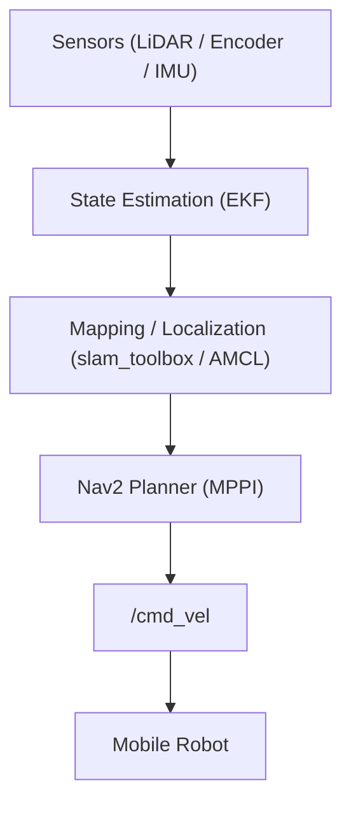
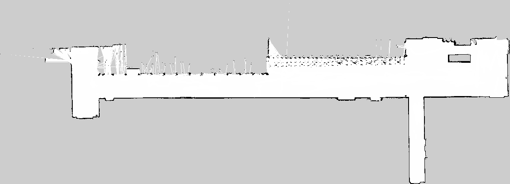
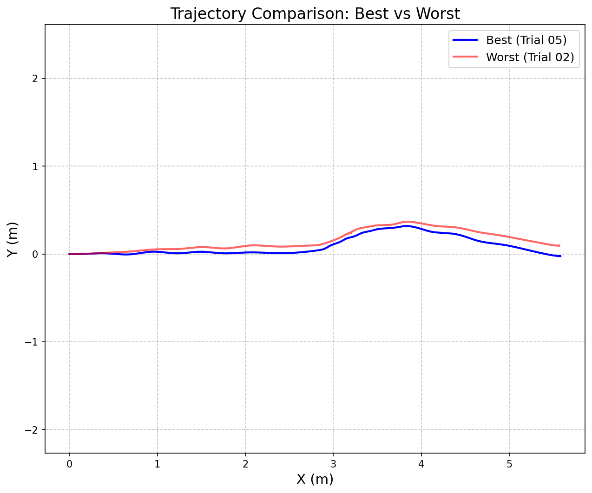
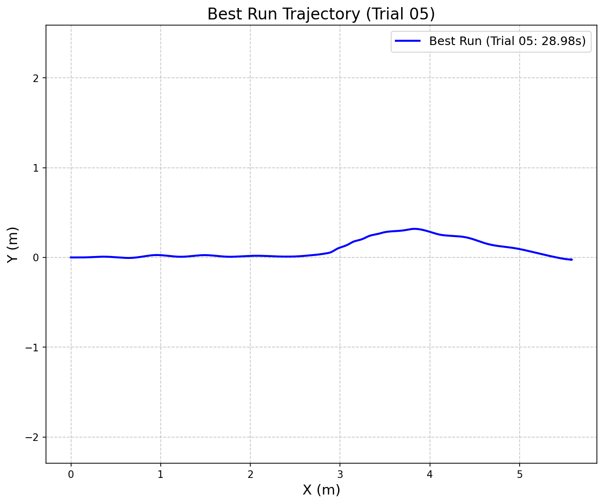
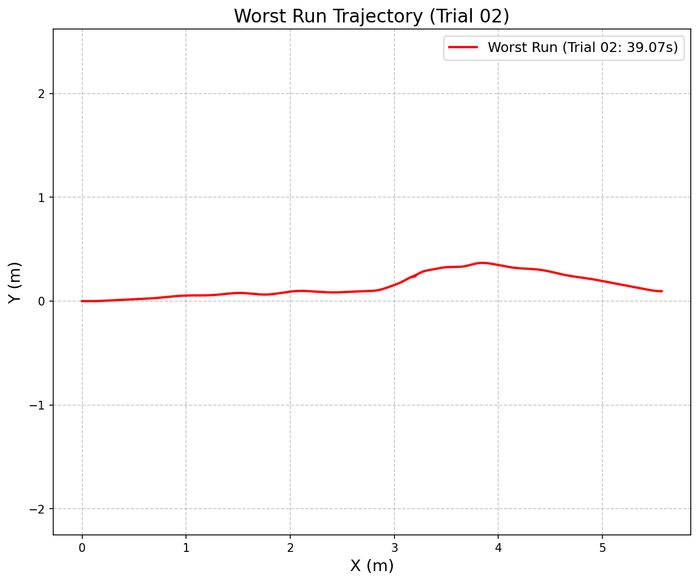

# Autonomous Security & Patrol Robot — ROS 2 + Nav2

An autonomous indoor patrol robot built on ROS 2 Nav2, covering the full pipeline from SLAM mapping and EKF-based localization to waypoint patrol and real-time person-following — implemented and tested on real hardware.

> **[한국어 요약](#korean-summary)** 는 하단에 있습니다.

---

## Demo

**MPPI — smooth obstacle avoidance**

https://github.com/user-attachments/assets/f9c3c259-7703-4743-8fe3-fea5d009ca3b

**DWB — blocked by obstacle**

https://github.com/user-attachments/assets/b387b12d-7978-4542-97ea-095fd69b85d6

---

## Features

- **End-to-End autonomous pipeline** — SLAM → Localization → Waypoint patrol on real hardware
- **Sensor fusion** — 2D LiDAR + Wheel Odometry + IMU via EKF (`robot_localization`)
- **MPPI local planner** — migrated from DWB; smooth obstacle avoidance with Model Predictive Path Integral control
- **Ping-pong waypoint patrol** — JSON-based waypoint list received from GUI; robot traverses forward and backward repeatedly
- **Person tracking mode** — on detection, Nav2 is preempted and the robot follows the person using a P-controller via RealSense depth data; automatically resumes patrol when the person disappears
- **Camera trigger** — publishes a capture trigger on arrival at each waypoint; waits for confirmation before moving to the next
- **Keepout zone** — costmap filter mask prevents the robot from entering restricted areas

---

## System Architecture

**Hardware**

| Component | Detail |
| :--- | :--- |
| Mobile base | Differential drive + wheel encoders |
| LiDAR | YDLidar (2D) |
| Depth camera | Intel RealSense (person tracking) |
| IMU | On-board IMU |
| Compute | Jetson Orin NX |

**Software stack**

| Layer | Component |
| :--- | :--- |
| OS | Ubuntu 22.04 |
| Middleware | ROS 2 Humble |
| Mapping | slam_toolbox |
| Localization | AMCL + robot_localization (EKF) |
| Navigation | Nav2 — MPPI controller |
| Visualization | RViz2 |
| Language | Python, C++ |

**Data flow**



**Patrol ↔ Tracking state machine**

```
Patrolling (Nav2 control)
    └─ Person detected → TRACKING (Nav2 cancelled, P-controller takes over)
          ├─ Person lost  → LOST   (robot stops, GUI notified)
          └─ Person gone  → IDLE   (2s AMCL convergence delay → patrol resumes)
```

**Key ROS topics**

| Direction | Topic |
| :--- | :--- |
| Sensor input | `/scan`, `/odom`, `/imu` |
| State estimation | `/tf` (EKF), `/amcl_pose` |
| GUI interface | `/patrol/waypoints_json`, `/patrol/command` |
| Robot pose (GUI) | `/robot_pose` (Pose2D, 10 Hz) |
| Person tracking | `/person_tracking/follow_state`, `/person_tracking/follow_target` |
| Control output | `/diff_drive_controller/cmd_vel_unstamped` |

---

## Key Engineering Challenges

### 1. IMU Drift & Sensor Fusion → [details](docs/imu_and_pose_issues.md)

During navigation, yaw deviated by up to **110°** and a persistent **~10° discrepancy** between AMCL and odometry was observed. Custom ROSbag analysis scripts were written to quantify the error over time, and EKF covariance weights were tuned to increase AMCL's contribution relative to IMU.

### 2. DWB Oscillation → MPPI Migration → [details](docs/navigation_issues.md)

The DWB planner produced severe goal-point oscillation and failed to clear costmap ghost obstacles left by structural pillars. After applying `laser_filter` to suppress near-range noise, DWB's algorithmic limitations remained. Migrating to **MPPI** resolved the oscillation and produced significantly smoother trajectories.

### 3. MPPI CPU Overload & Tuning → [details](docs/mppi_tuning.md)

At initial settings, the control loop dropped from 10 Hz to 5–6 Hz due to CPU overload, causing overshoot and repeated goal-checking loops. Tuning `batch_size`, `time_steps`, and aligning `model_dt = 1 / controller_frequency` stabilized the loop at 20 Hz.

### 4. AMCL Convergence After Person Tracking

After the person-tracking P-controller preempts Nav2, AMCL needs time to re-converge. Resuming patrol immediately caused MPPI to plan from a stale pose and oscillate near the goal. A **2-second delay + `clearLocalCostmap()`** call before resuming solved this.

### 5. LiDAR Timestamp Drift → [details](docs/sensor_issues.md)

YDLidar's driver stamped scan messages using sensor-side time, causing `TF_OLD_DATA` warnings and dropped scans in AMCL and the costmap. A lightweight `scan_restamper` node re-stamps incoming scans with `ros::Time::now()` before forwarding to Nav2.

---

## Environment & Map

The map was built using slam_toolbox in a real indoor corridor environment (resolution: 0.05 m/px).



---

## Experiment Results

Repeated patrol runs were conducted to evaluate MPPI navigation consistency. Odometry trajectories were recorded and analyzed across multiple trials.

**Best vs Worst trajectory comparison**

| | Trial | Time-to-goal |
| :--- | :--- | :--- |
| Best run | Trial 05 | 28.98 s |
| Worst run | Trial 02 | 39.07 s |



> Blue (Best, Trial 05): smooth, consistent path with minimal lateral deviation.
> Red (Worst, Trial 02): jagged path with sharp direction changes, caused by CPU lag and control loop delays.

**Individual trajectories**

| Best Run (Trial 05) | Worst Run (Trial 02) |
| :---: | :---: |
|  |  |

For full analysis see [docs/experiments/trajectory_comparison.md](docs/experiments/trajectory_comparison.md).

---

## Quick Start

**Build and source** (run in every new terminal)

```bash
cd ~/navigation_stack_lab/ws_robot
colcon build --symlink-install
source install/setup.bash
```

**1. SLAM — build a map**

```bash
# Terminal 1: hardware bringup
ros2 launch robot_base bringup.launch.py

# Terminal 2: SLAM
ros2 launch robot_base slam.launch.py

# Terminal 3: save map
ros2 run nav2_map_server map_saver_cli -f ~/navigation_stack_lab/ws_robot/src/robot_base/maps/my_map \
  --ros-args -p save_map_timeout:=10000
```

**2. Autonomous navigation + patrol**

```bash
# Terminal 1: hardware bringup
ros2 launch robot_base bringup.launch.py

# Terminal 2: Nav2 + TF bridge
ros2 launch robot_base nav2.launch.py

# Terminal 3: patrol node
ros2 launch robot_base patrol.launch.py
```

> The AMCL initial pose is hardcoded in `config/mppi_coordi.yaml`. Update `initial_pose` (x, y, yaw) to match your environment before launching.

---

## Project Status

| Item | Status |
| :--- | :---: |
| LiDAR / IMU / Odometry integration | Done |
| EKF sensor fusion & drift correction | Done |
| slam_toolbox 2D mapping | Done |
| AMCL localization | Done |
| Nav2 waypoint navigation | Done |
| MPPI local planner tuning | Done |
| GUI JSON waypoint interface | Done |
| Person tracking mode (P-controller) | Done |
| DWB vs MPPI comparative experiments | Planned |
| Quantitative planner performance analysis | Planned |

---

## Troubleshooting Docs

| Issue | Document |
| :--- | :--- |
| LiDAR sensor & timestamp issues | [docs/sensor_issues.md](docs/sensor_issues.md) |
| Control & encoder issues | [docs/control_and_encoder.md](docs/control_and_encoder.md) |
| TF / coordinate frame issues | [docs/tf_and_frame.md](docs/tf_and_frame.md) |
| SLAM map distortion | [docs/mapping_issues.md](docs/mapping_issues.md) |
| Navigation oscillation — DWB → MPPI | [docs/navigation_issues.md](docs/navigation_issues.md) |
| IMU drift & sensor fusion | [docs/imu_and_pose_issues.md](docs/imu_and_pose_issues.md) |
| MPPI tuning & crash records | [docs/mppi_tuning.md](docs/mppi_tuning.md) |

---

## Korean Summary

ROS 2 Nav2 기반 자율주행 순찰 로봇 시스템입니다. 실제 환경(복도, 사람 장애물)에서 SLAM → 위치 추정 → Waypoint 순찰 → 사람 추적까지의 End-to-End 파이프라인을 직접 구축하고 운용했습니다.

**핵심 문제 해결:**
1. **IMU Drift 보정** — 최대 110도 Yaw 오차를 ROSbag 분석 스크립트로 정량화하고 EKF 공분산 튜닝으로 해결
2. **DWB → MPPI 마이그레이션** — 목표 지점 진동 및 Costmap 잔상 문제를 MPPI 전환으로 해결
3. **사람 추적 모드** — 사람 감지 시 Nav2를 취소하고 P제어로 직접 추적, 사라지면 자동 순찰 재개
4. **AMCL 수렴 대기** — 추적 종료 후 즉시 재개 시 발생하는 oscillation을 2초 딜레이로 해결
5. **LiDAR 타임스탬프 보정** — `scan_restamper` 노드로 YDLidar 드라이버의 stamp 불일치 해결
